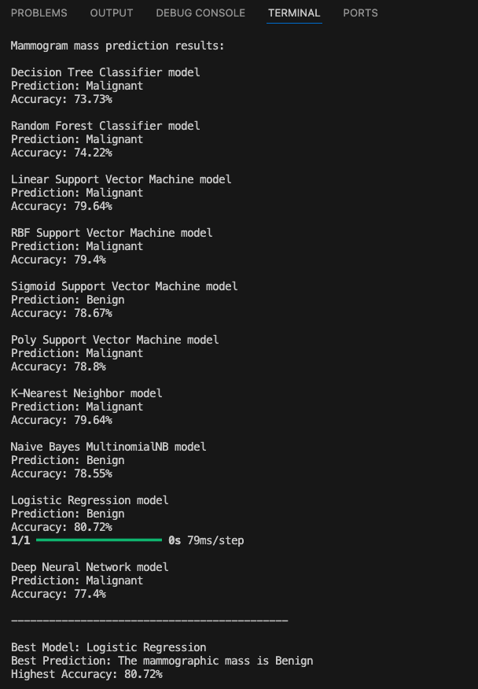

# Mammogram mass predictor

Traditional radiologists' analysis of mammograms is time-consuming and prone to variability. Misdiagnoses can result in false negatives (missed cancer) or false positives (unnecessary interventions). Deep learning, particularly neural networks (DNNs), has shown promise in image recognition tasks and offers the potential to assist in the accurate classification of breast cancer in mammograms. The challenge lies in developing a robust model that can be generalized to real-world clinical data. In this project I developed several machine learning models and assessed their accuracy and selected the best model to predict whether a mammogram mass is benign or malignant.

## Machine learning models used:

- Decision Tree Classifier
- Random Forest Classifier
- K-Nearest Neighbors
- Naive Bayes MultinomialNB
- Support Vector Machines
- Logistic Regression
- Deep Neural Network

## Results
